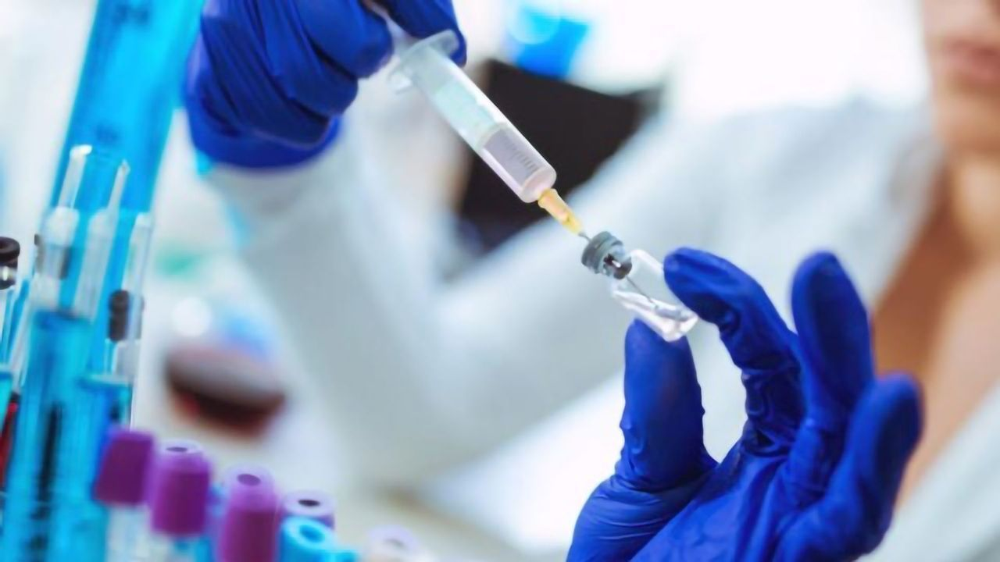
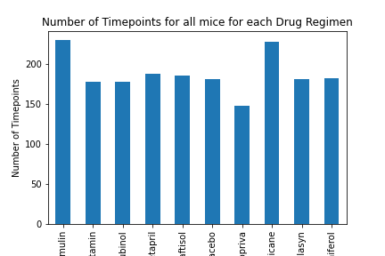
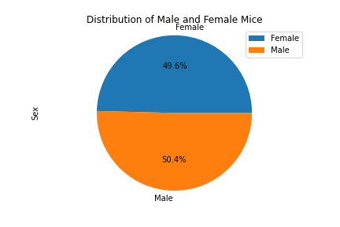
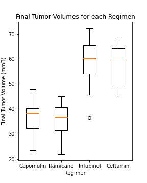
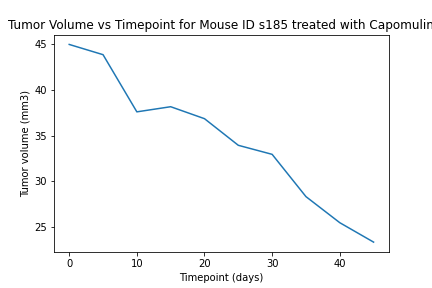
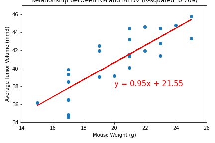

# Mouse Tumor Treatment Study Analysis

 

### Summary

249 mice identified with SCC tumor growth were treated through a variety of drug regimens. Over the course of 45 days, tumor development was observed and measured. The purpose of this study was to compare the performance of Pymaceuticals' drug of interest, Capomulin, versus the other treatment regimens. 

 

### Outline of steps perfomed for analysis
* Merged Mice and Study Datasets.
* Checked if any mice had duplicated values.
* Dropped single mouse found with duplicate values from data set.
* Created Summary Statistics datframe for each Drug Regimen.
* Created bar chart for Number of Timepoints vs Drug Regimen.
* Created pie chart showing distribution of Male and Female mice.
* Got Tumor volume for each mouse at last timepoint.
* Used for loop to perform statistical analysis on each drug regimen data to analyse for outliers.
* Generated a boxplot from the results.
* Created a line plot for Tumor Volume vs Timpoint for a specific Mouse ID that was treated with Capomulin.
* Generated a scatter plot of average tumor volume 

 

### Examples of plots produced

